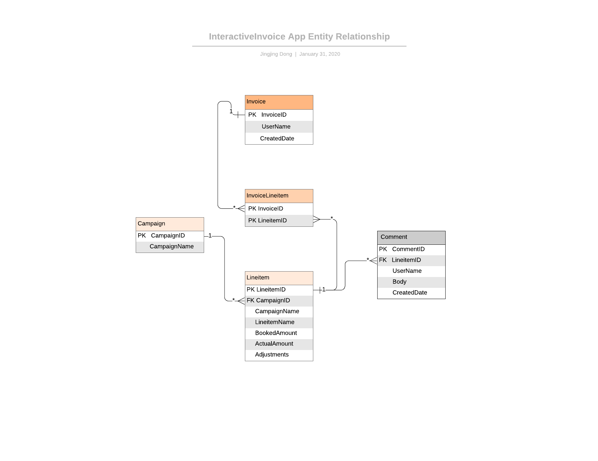
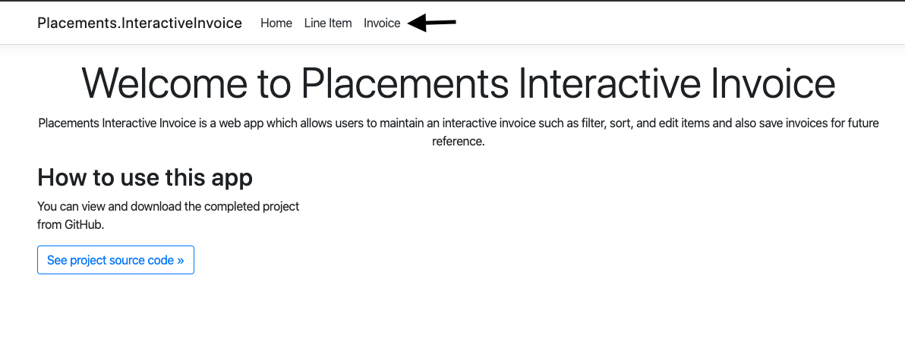
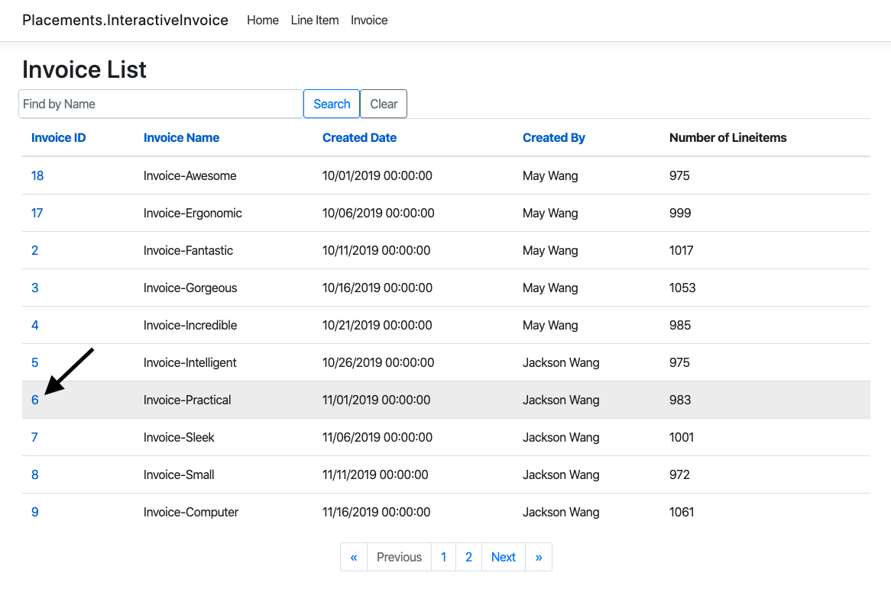

# Placements.InteractiveInvoice: Coding Challenge

## Frameworks: ASP.NET Core 3.1 & .NET Core 3.1
###### Why ASP.NET Core?
* Open-source
* Develop and run your ASP.NET Core apps cross-platform on Windows, MacOS, and Linux
* Great for modern cloud-based apps, such as web apps, IoT apps, and mobile backends
* ASP.NET Core apps can run on .NET Core or on the full .NET Framework
* Designed to provide an optimized development framework for apps that are deployed to the cloud or run on-premises

## Dependencies:
* EntityFramework Core 3.1.1
* EntityFramework Core .NET Command-line Tools 3.1.1 for database migrations

## Database: 
* Development: SqlServer on Docker 
* Deployment: Azure SqlServer
* Relationships:

## How to publish and deploy
I containerize this app into docker image and deploy on Heroku to host 
1. clone this repository [Link](https://github.com/j-dong-cs/Placements.InteractiveInvoice.git)
2. Install [Heroku CLI](https://devcenter.heroku.com/articles/heroku-cli) 
    - check after installation by type in terminal:
  ` % heroku version `
  ` heroku/7.37.0 darwin-x64 node-v12.13.0 `
3. Install [Docker](https://docs.docker.com/install/)
    - check after installation by type in terminal:
   ` % docker --version `
   ` Docker version 19.03.5, build 633a0ea `
4. cd to the repository root folder which contains the Dockerfile
5. Login to Heroku account and create new app with {app_name}
6. Run ` % heroku login` in terminal to log in to your Heroku account
7. Run ` % docker ps ` to make sure docker is setup locally
8. Run ` % heroku container:login ` to sign into Container Registry
9. Run ` % heroku container:push web -a {app_name} ` to push docker_based app
10. Run ` % heroku container:release web -a {app_name} ` to deploy the app

## Usecases implemented and Instructions to run
### Bucket 1
1. The user should be able browse through the line-item data as either a list or table (ie.
pagination or infinite-scrolling).
  Link: https://placements-interactiveinvoice.herokuapp.com/Invoice/Details/6
  - navigate to Invoice tab
    
  - click into one invoice
    
  - lineitems are paginated
  - arrows represnet first and end page; 
    Previous and Next link will be disabled if there is no prev or next page;

2. The user should be able to edit line-item "adjustments".
  Link: https://placements-interactiveinvoice.herokuapp.com/Lineitem/Edit/6/6
  - follow steps in usecase 1
  - click Edit link for one lineitem
  - enter number into adjustments and click save
  - page will be redicted to invoice and subtotal and grandtotal amount are also updated
  
3. The user should be able to see each line-item's billable amount (sub-total = actuals +
adjustments). 
  Link: https://placements-interactiveinvoice.herokuapp.com/Invoice/Details/6
 - follow steps in usecase 1 and see pagination pic

4. The user should be able to see sub-totals grouped by campaign (line-items grouped by their
parent campaign).
  Link: https://placements-interactiveinvoice.herokuapp.com/Invoice/Details/6
  - follow steps in usecase 1
  - click "Subtotals by Campaign" button and a modal will pop up showing the subtotals of 
    billable amount grouped by each campaign in ascending order
  - 
  
5. The user should be able to see the invoice grand-total (sum of each line-item's billable
amount).
  Link: https://placements-interactiveinvoice.herokuapp.com/Invoice/Details/6
  - follow steps in usecase 1
  
6. The user should be able to sort the data.
  Link: https://placements-interactiveinvoice.herokuapp.com/Invoice/Details/6
  - follow steps in usecase 1
  - click the table names to apply sorting; by default, the list is sorted in ascending order by lineitem id
  - user can sort lineitems by id, name, booked amount, actual amount, and billable amount.
  
7. The user should be able to browse/filter/sort the invoice history, as well.
  Link: https://placements-interactiveinvoice.herokuapp.com/Invoice
  - pagination also applied to invoices view
  - user can sort invoices by id, name, created date, and username
  - search invoice by name
  
### Bucket 2
8. The user should be able to filter the data (ie. by campaign name, etc., should affect the
grand-total).
  Link: https://placements-interactiveinvoice.herokuapp.com/Invoice/Details/2
  - search by campaign name and notice that pagination, subtotal, and grand total are also changed according to search result

9. The user should be able to add comments on an individual line-item.
  Link: https://placements-interactiveinvoice.herokuapp.com/Lineitem/Details/2
  - add a new comment to lineitem 2 and the most-recent-added comment will appear to the top of all comments
  - each comment show the author, content, and created time (user login has not implemented yet.)
  
  
